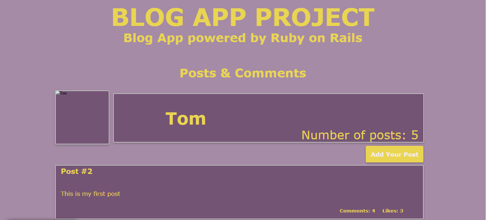

<a name="readme-top"></a>

<div align="center">
 
  <h1><b>Blog App</b></h1>
 
  
  <br/>

</div>


# 📗 Table of Contents

- [📖 About the Project](#about-project)
  - [🛠 Built With](#built-with)
    - [Tech Stack](#tech-stack)
    - [Key Features](#key-features)
- [💻 Getting Started](#getting-started)
  - [Setup](#setup)
  - [Prerequisites](#prerequisites)
  - [Run tests](#run-tests)
- [👥 Authors](#authors)
- [🔭 Future Features](#future-features)
- [🤝 Contributing](#contributing)
- [⭐️ Show your support](#support)
- [🙏 Acknowledgements](#acknowledgements)
- [❓ FAQ](#faq)
- [📝 License](#license)

# 📖 [BLOG APP] <a name="about-project"></a>

**[BLOG APP]**  The Blog app is a classic example of a blog website. I created a fully functional website that will show the list of posts and empower readers to interact with them by adding comments and liking posts.

## 🛠 Built With <a name="built-with"></a>

1- Ruby 3.2.2<br>
2- Rails 7.0.7.2<br>
3- PostgreSQL<br>
4- Gitflow<br>
5- Rubocop<br>
6- RSpec

### Tech Stack <a name="tech-stack"></a>

<details>
  <summary>Client</summary>
  <ul>
    <li><a href="https://www.microverse.org/">Microverse</a></li>
  </ul>
</details>

<details>
<summary>Ruby</summary>
  <ul>
    <li><a href="https://www.ruby-lang.org/">Ruby</a></li>
  </ul>
</details>

<details>
<summary>Rails</summary>
  <ul>
    <li><a href="https://www.rubyonrails.org/">Rails</a></li>
  </ul>
</details>

<details>
<summary>Database</summary>
  <ul>
    <li><a href="https://www.postgresql.org/">PostgreSQL</a></li>
  </ul>
</details>


### Key Features <a name="key-features"></a>

- **[Creating a data model]**
- **[Processing data in models]**
- **[Validations and Model specs]**
- **[Setup and controllers]**
- **[Controllers specs]**
- **[Views]**
- **[Forms]**


<p align="right">(<a href="#readme-top">back to top</a>)</p>

## 💻 Getting Started <a name="getting-started"></a>

To get a local copy up and running, follow these steps.

### Prerequisites

In order to run this project you need:

Windows Subsystem for Linux (WSL)<br>
Web Browser (Chrome recommended)<br>
Code editor (VS recommended)<br>
GitHub account<br>

> You need the following tools be installed in your computer:

> - [WSL](https://gorails.com/setup/windows/11#linux-subsystem)
> - [Git](https://www.linode.com/docs/guides/how-to-install-git-on-linux-mac-and-windows/)
> - [Ruby](https://github.com/microverseinc/curriculum-ruby/blob/main/simple-ruby/articles/ruby_installation_instructions.md)
> - [Rails](https://gorails.com/setup/windows/11#overview)


### Setup

Clone this repository to your desired folder:

```sh
  cd my-folder
  git clone "https://github.com/JuanDBta/blog-app.git"
```
### Run

Go to your /blog-app folder:

```sh
  cd blog-app
  rails server
```
To run Rails console:

```sh
  cd blog-app
  rails c
```

### Run tests

To run tests:

```sh
  cd blog-app
  bundle install
  rspec spec
```

<p align="right">(<a href="#readme-top">back to top</a>)</p>

## 👥 Authors <a name="authors"></a>

👤 **Micronaut JUAN DAVID DIAZ**

- GitHub: [@JuanDBta](https://github.com/JuanDBta)
- Twitter: [@simplebetsas](https://twitter.com/simplebetsas)
- LinkedIn: [LinkedIn](https://linkedin.com/in/simplebet/)

<p align="right">(<a href="#readme-top">back to top</a>)</p>

## 🔭 Future Features <a name="future-features"></a>

- [ ] **[Integration specs for Views and fixing n+1 problems]**
- [ ] **[Add Devise]**
- [ ] **[Add authorization rules]**
- [ ] **[Add API endpoints]**
- [ ] **[API documentation]**

<p align="right">(<a href="#readme-top">back to top</a>)</p>

## 🤝 Contributing <a name="contributing"></a>

Contributions, issues, and feature requests are welcome!

Feel free to check the [issues page](../../issues/).

<p align="right">(<a href="#readme-top">back to top</a>)</p>

## ⭐️ Show your support <a name="support"></a>

If you like this project, please give me a like, it doesn't cost you anything and it helps me a lot to keep working.

<p align="right">(<a href="#readme-top">back to top</a>)</p>

## 🙏 Acknowledgments <a name="acknowledgements"></a>

I would like to thank Bee in Student Success who is always avalaible to solve issues and Microverse for push us to work hard every day!

<p align="right">(<a href="#readme-top">back to top</a>)</p>

## ❓ FAQ <a name="faq"></a>

- **["How can I see more projects associated with this authors?"]**

  - Check my [Github Profile](https://github.com/JuanDBta)

- **[How can I contact the author of this project?]**

  - Check my [LinkedIn profile](https://linkedin.com/in/simplebet/) or email me at simplebetsas@gmail.com
  

<p align="right">(<a href="#readme-top">back to top</a>)</p>

## 📝 License <a name="license"></a>

This project is [MIT](./LICENSE) licensed.

<p align="right">(<a href="#readme-top">back to top</a>)</p>
 